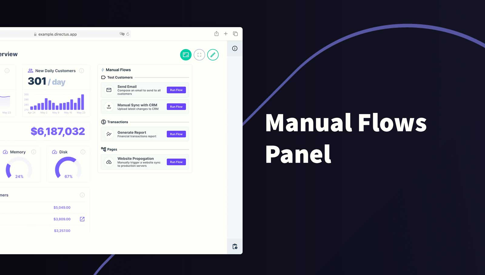
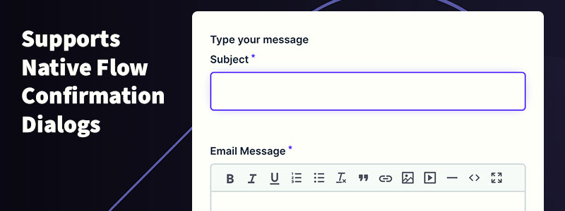
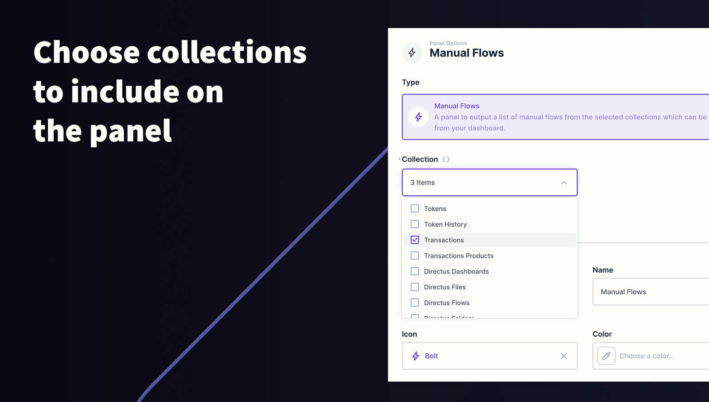

# Directus Manual Flows Panel

Place your manual flows together in a convenient panel on your dashboard

## Details

- This extension will bring your manual flows from multiple collections together into a convenient panel or split them into several panels.
- Uses the flows endpoint and native components to provide the same functionality. Simply choose the collections that you want to include.

## Requirements

- Directus 10.0.0+

## How to add this Panel to a Dashboard

1. Add this extension into the project's extensions/operations folder
2. Start/Restart Directus
3. Create a new Panel and select **Manual Flows** from the list
4. Choose all the collections that you would like to include on the panel
5. (Optional) Use the header to create a name for this panel
6. Save the panel and position/resize as required
7. Save the dashboard

## How to use this Panel

Simply click **Run Flow** on the desired flow.

### Confirmation Dialog

The Manual Flows Panel supports the confirmation dialog and any form fields associated with the Flow.

## Permissions

Users will only see a manual flow if they have **Read** permissions on it's collection and **Read** permissions on Directus Flows. Beyond that, the Flow will adhere to it's own permissions.

## Screenshots

